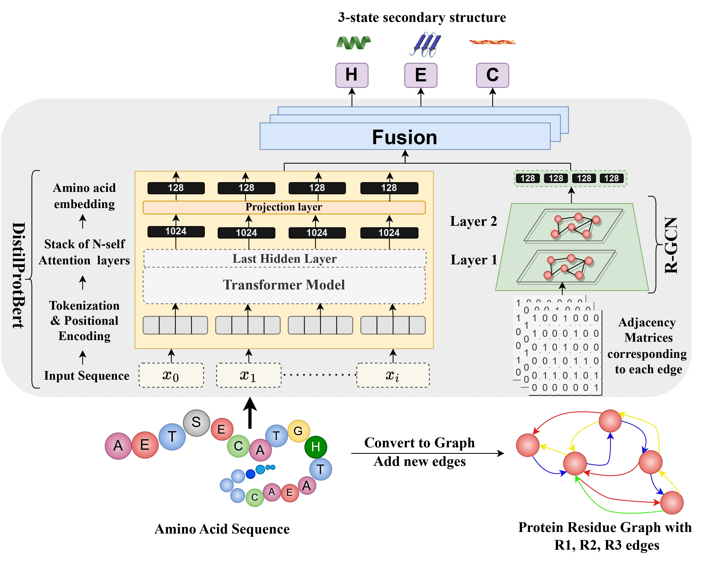
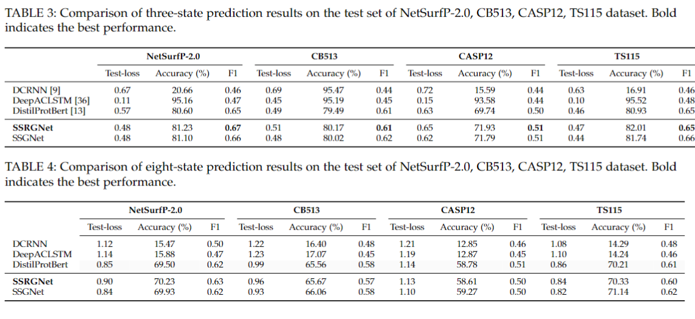

## Introduction

**Protein Secondary Structure Prediction Using Contact Maps** is a project aimed at predicting secondary structures from protein primary sequences. This is a pivotal step towards predicting tertiary structures and provides crucial insights into protein activity, relationships, and functions. While many existing methods utilize extensive sets of unlabeled amino acid sequences, our approach harnesses the power of accessible protein 3D structural data, which plays a decisive role in dictating protein functions. By combining Graph Neural Networks (GNNs) and Language Models (LMs), we capture enhanced spatial information and geometric characteristics of protein structures, leading to improved prediction accuracy.

## Visuals

<p align="center">
  
</p>
<p align="center">
  Architecture of the SSRGNet Model - This diagram showcases the design and flow of the SSRGNet model, highlighting its components and their interactions.
</p>


## Installation & Usage:

### Prerequisites:
Before you begin, ensure you have the required dependencies installed. You can install them using the following command:
```bash
pip install -r requirements.txt
```

### Data Preprocessing:

1. **Fetch the PDB files**:
   - Run the following command to preprocess and fetch the PDB files.
     ```bash
     python scripts/preprocessing_scripts/preprocess.py
     ```

2. **Calculate Distances**:
   - Calculate the distances between c_alpha items in the pdb files using:
     ```bash
     python scripts/preprocessing_scripts/distance.py
     ```

3. **Prepare Data for Language Model**:
   - Generate necessary files like `df_final.xlsx`, `cb513_final.xlsx`, etc.
     - Run the `notebooks/data_prepare.ipynb` notebook.
     - Ensure you adjust the paths accordingly in the notebook.
   - After generating the excel file, create a text file containing primary and secondary sequences.
     - Run the `notebooks/pdbfile_process.ipynb` notebook.

4. **Generate Graph File**:
   - After creating the distance file and .txt files, you can generate the graph file containing the adjacency matrix.
     - For relational data:
       ```bash
       python scripts/preprocessing_scripts/adjacency_relational.py
       ```
     - For non-relational data:
       ```bash
       python scripts/preprocessing_scripts/adjacency.py
       ```

5. **Prepare Sequence IDs for Language Model**:
   - Generate necessary files in the HuggingFace format: `input_ids`, `attention_mask`, `labels`, `token_type_ids`.
     - Run the `notebooks/prepare_raw_tokenization_file.ipynb` notebook.

**Note**: To switch between q3 and q8, adjust the code in the respective sections.

### Training:

- **Configuration**: Before running any training script, check and adjust the configuration accordingly.

- **Training Scripts**:
  - For hyperparameter tuning using wandb's sweep:
    ```bash
    CUDA_VISIBLE_DEVICES=0 python scripts/train/train_with_sweep.py
    ```
  - To train the baseline model:
    ```bash
    CUDA_VISIBLE_DEVICES=0 python scripts/train/train_baseline.py
    ```
  - To train the model without wandb:
    ```bash
    CUDA_VISIBLE_DEVICES=0 python scripts/train/train_without_wandb.py
    ```

## Results
-----------------

### Summary:

Our model, **SSRGNet**, showcased promising results in predicting protein secondary structures. Here are some key takeaways:

- **Accuracy**: Our model achieved an accuracy of 81.23%(q3), surpassing the baseline by 80.60%.
- **F1-Score**: The F1-score, which is a measure of the model's precision and recall, stood at 0.67%, indicating a balanced performance.
- **Comparison**: When compared to other state-of-the-art models, SSRGNet ranked first, showcasing its potential in the domain of protein structure prediction.

### Interpretation:

The results indicate that by leveraging both Graph Neural Networks (GNNs) and Language Models (LMs), we can effectively capture the intricate interconnections and dependencies in protein structures. The high accuracy and F1-score suggest that the model is not only accurate but also consistent in its predictions across different protein sequences.

## Contact & Support

For any queries, suggestions, or support, please [open an issue](https://github.com/SamarthGarg09/protein-secondary-structure-prediction/issues/new) on our GitHub repository. We'll do our best to address your concerns promptly.
